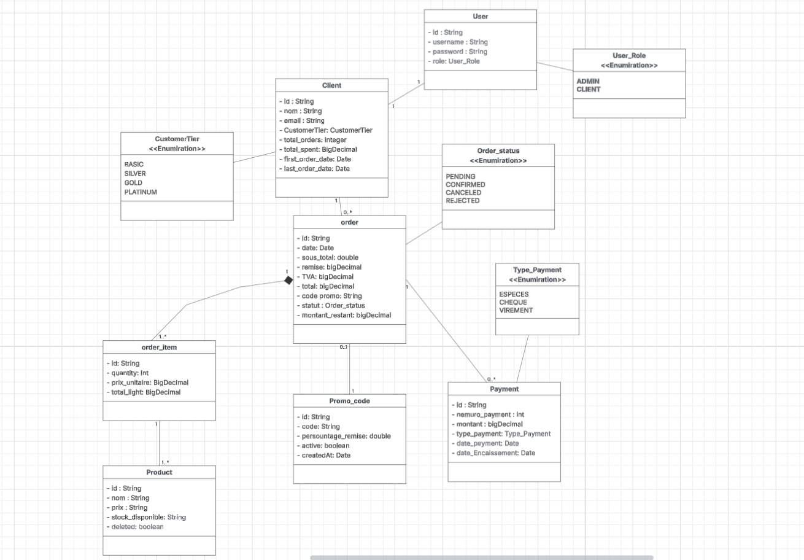

# SmartShop API Documentation

## Overview

SmartShop API is a comprehensive RESTful e-commerce backend service that provides complete functionality for managing an online shopping platform. The API handles authentication, client management, product catalog, order processing, payment handling, and promotional code administration.

## Base URL

```
http://localhost:8080/api
```

## Authentication

The API uses session-based authentication. Users must log in to receive authentication credentials that are used for subsequent requests.

### Login
- **Endpoint:** `POST /auth/login`
- **Description:** Authenticates a user and creates a session
- **Request Body:**
```json
{
  "username": "admin",
  "password": "password"
}
```
- **Response:** Returns authentication token or session cookie

### Logout
- **Endpoint:** `POST /auth/logout`
- **Description:** Terminates the current user session
- **Authentication:** Required

## Client Management

Endpoints for managing client accounts and profiles.

### Create Client
- **Endpoint:** `POST /clients`
- **Description:** Registers a new client account with associated user credentials
- **Request Body:**
```json
{
  "nom": "Wissam",
  "email": "wissam@example.com",
  "user": {
    "username": "client1",
    "password": "123456",
    "role": "CLIENT"
  }
}
```

### Get Client Profile
- **Endpoint:** `GET /clients/profile`
- **Description:** Retrieves the authenticated client's profile information
- **Authentication:** Required

### Update Client
- **Endpoint:** `PATCH /clients/{clientId}`
- **Description:** Updates client information
- **Path Parameters:**
    - `clientId` - The unique identifier of the client
- **Request Body:**
```json
{
  "nom": "Updated Name",
  "email": "updated@example.com"
}
```
- **Authentication:** Required

### Delete Client
- **Endpoint:** `DELETE /clients/{clientId}`
- **Description:** Removes a client account from the system
- **Path Parameters:**
    - `clientId` - The unique identifier of the client
- **Authentication:** Required

## Product Management

Endpoints for managing the product catalog.

### Get All Products
- **Endpoint:** `GET /products`
- **Description:** Retrieves a paginated list of all products
- **Query Parameters:**
    - `page` - Page number (default: 0)
    - `size` - Number of items per page (default: 10)
- **Example:** `GET /products?page=0&size=10`

### Create Product
- **Endpoint:** `POST /products`
- **Description:** Adds a new product to the catalog
- **Request Body:**
```json
{
  "nom": "Produit 1",
  "prixUnitaire": 120.5,
  "stockDisponible": 50
}
```
- **Authentication:** Required (Admin)

### Get Product by ID
- **Endpoint:** `GET /products/{productId}`
- **Description:** Retrieves detailed information about a specific product
- **Path Parameters:**
    - `productId` - The unique identifier of the product

### Update Product
- **Endpoint:** `PUT /products/{productId}`
- **Description:** Updates product information
- **Path Parameters:**
    - `productId` - The unique identifier of the product
- **Request Body:**
```json
{
  "nom": "Updated Product",
  "prixUnitaire": 99.99,
  "stockDisponible": 20
}
```
- **Authentication:** Required (Admin)

### Delete Product
- **Endpoint:** `DELETE /products/{productId}`
- **Description:** Removes a product from the catalog
- **Path Parameters:**
    - `productId` - The unique identifier of the product
- **Authentication:** Required (Admin)

## Order Management

Endpoints for creating and managing orders.

### Create Order
- **Endpoint:** `POST /orders`
- **Description:** Creates a new order with specified items and optional promo code
- **Request Body:**
```json
{
  "clientId": "1",
  "promoCode": "PROMO10", // if you have it
  "items": [
    { "productId": "1", "quantity": 2 },
    { "productId": "2", "quantity": 1 }
  ]
}
```
- **Authentication:** Required

### Get Client Orders History
- **Endpoint:** `GET /orders/client/{clientId}`
- **Description:** Retrieves all orders placed by a specific client
- **Path Parameters:**
    - `clientId` - The unique identifier of the client
- **Authentication:** Required

### Confirm Order After Payment
- **Endpoint:** `PUT /orders/{orderId}/confirm`
- **Description:** Confirms an order after successful payment processing
- **Path Parameters:**
    - `orderId` - The unique identifier of the order
- **Authentication:** Required

## Payment Processing

Endpoints for handling order payments.

### Pay Order
- **Endpoint:** `POST /payment`
- **Description:** Processes payment for an order
- **Request Body:**
```json
{
  "orderId": "1",
  "montant": 200,
  "typePayment": "ESPECES",
  "dateEcheance": null // required in CHEQUE payment type
}
```
- **Payment Types:** ESPECES (cash), or other supported payment methods
- **Authentication:** Required

## Promotional Codes

Endpoints for managing promotional discount codes.

### Save Promo Code
- **Endpoint:** `POST /promoCode`
- **Description:** Creates a new promotional code
- **Request Body:**
```json
{
  "code": "PROMO10",
  "percentageRemise": 10,
  "active": true
}
```
- **Authentication:** Required (Admin)

### Deactivate Promo Code
- **Endpoint:** `PUT /promoCode/{promoId}`
- **Description:** Deactivates an existing promotional code
- **Path Parameters:**
    - `promoId` - The unique identifier of the promo code
- **Authentication:** Required (Admin)

## Variables

The API uses the following path variables throughout the documentation:

- `clientId` - Client identifier
- `orderId` - Order identifier
- `productId` - Product identifier
- `promoId` - Promo code identifier

## Response Format

All API responses are returned in JSON format. Successful requests typically return a 200 status code along with the requested data or confirmation message. Error responses include appropriate HTTP status codes and error details.

## Error Handling

The API uses standard HTTP status codes:
- 200: Success
- 201: Created
- 400: Bad Request
- 401: Unauthorized
- 404: Not Found
- 500: Internal Server Error

## Getting Started

1. Start the SmartShop API server on localhost:8080
2. Authenticate using the login endpoint
3. Use the returned session credentials for subsequent API calls
4. Begin managing products, clients, orders, and payments

## Class Diagram
